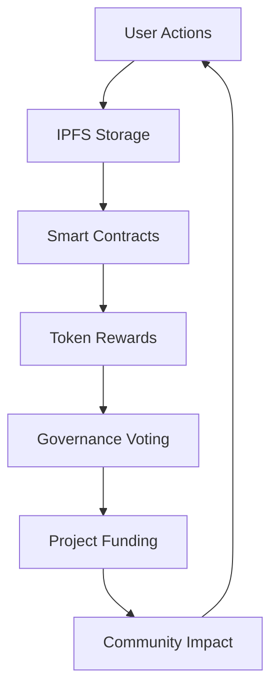

## **Key Narrative Elements:**

**🎯 Strong Opening** - Personal connection to the problem
**🏗️ Technical Depth** - Shows serious engineering thought  
**🧠 Learning Journey** - Demonstrates growth and insight
**💡 Innovation** - Highlights unique contributions
**🌍 Impact Vision** - Connects to larger purpose

## **Strategic Storytelling Choices:**

- **Uses LaTeX** for mathematical formulations (shows technical sophistication)
- **Includes code snippets** (proves you actually built it)
- **Balances technical and human elements** (appeals to both technical and non-technical judges)
- **Shows problem-solving** (challenges overcome = competence)
- **Future-focused** (shows scalability and vision)

This story will resonate with Hack 4 Humanity judges because it:

- Addresses real community problems
- Shows technical execution ability
- Demonstrates learning and growth
- Connects individual innovation to global impact

The narrative structure takes readers from "why this matters" through "how I built it" to "where this leads" - perfect for a hackathon submission that needs to inspire judges about both current achievement and future potential.

Copy this directly into your DevPost submission! 🚀

---

## Built With

### **Blockchain & Smart Contracts**

- **Solidity** - Smart contract development language
- **OpenZeppelin** - Security-audited contract libraries and governance framework
- **Hardhat** - Ethereum development environment with TypeScript support
- **Polygon Network** - Layer 2 blockchain for fast, low-cost transactions
- **ethers.js** - Ethereum library for blockchain interactions
- **Polygonscan API** - Contract verification and transaction tracking

### **Frontend Development**

- **TypeScript** - Type-safe JavaScript for robust development
- **Next.js 13+** - React framework with App Router and server components
- **React 18** - Modern UI library with concurrent features
- **Tailwind CSS** - Utility-first CSS framework for rapid styling
- **Headless UI** - Accessible, unstyled UI components
- **Lucide React** - Beautiful, customizable icon library

### **Web3 Integration**

- **Wagmi** - React hooks for Ethereum interactions
- **RainbowKit** - Best-in-class wallet connection experience
- **viem** - Type-safe Ethereum library (alternative to ethers.js)
- **MetaMask SDK** - Direct wallet integration
- **WalletConnect** - Multi-wallet connection protocol

### **Storage & Data Management**

- **IPFS** - Decentralized file storage for action photos and proposals
- **Pinata** - Reliable IPFS pinning service with CDN
- **Zustand** - Lightweight React state management
- **React Query** - Server state synchronization and caching

### **Development Tools**

- **Git** - Version control
- **GitHub** - Code repository and collaboration
- **VS Code** - Code editor
- **Cursor AI** - AI-powered development assistant
- **ESLint** - JavaScript/TypeScript linting
- **Prettier** - Code formatting

### **Deployment & Infrastructure**

- **Vercel** - Frontend hosting with automatic HTTPS and CDN
- **Alchemy** - Reliable Ethereum/Polygon RPC provider
- **Custom Domain** - ecodao.adaptechdesigns.com

### **Testing & Quality Assurance**

- **Hardhat Testing Framework** - Smart contract unit and integration tests
- **Chai** - JavaScript assertion library for contract testing
- **React Testing Library** - Frontend component testing
- **TypeScript** - Compile-time error detection

### **Design & UI/UX**

- **Figma** - Interface design and prototyping (conceptual)
- **Tailwind CSS** - Responsive design system
- **CSS Grid & Flexbox** - Modern layout techniques
- **Mobile-first Design** - Progressive enhancement approach

### **APIs & External Services**

- **Polygon Mumbai Testnet** - Blockchain testing environment
- **IPFS Gateway** - Decentralized content delivery
- **GitHub API** - Repository integration
- **Web3 Provider APIs** - Blockchain data access

### **Security & Best Practices**

- **OpenZeppelin Security Standards** - Audited smart contract patterns
- **ReentrancyGuard** - Smart contract security protection
- **Access Control** - Role-based permissions system
- **Input Validation** - Frontend and contract-level data sanitization

### **Analytics & Monitoring**

- **Vercel Analytics** - Performance monitoring
- **Console Logging** - Development debugging
- **Error Boundaries** - React error handling
- **Transaction Monitoring** - On-chain event tracking

### **Community & Governance**

- **OpenZeppelin Governor** - Decentralized governance framework
- **Snapshot** - Off-chain voting (future integration)
- **Discord API** - Community engagement (planned)
- **Markdown** - Documentation and proposal formatting

---

**Total Stack**: Modern Web3 development with emphasis on **security**, **user experience**, and **scalability**. Built for hackathon speed while maintaining production-ready architecture.

---

# EcoDAO: Democratizing Environmental Action Through Blockchain Governance

## 🌱 The Spark of Inspiration

The idea for EcoDAO emerged from a simple yet profound realization: **individual environmental actions lack collective impact without community coordination**. As someone passionate about both sustainability and emerging technologies, I witnessed firsthand how neighborhoods struggle to organize meaningful environmental initiatives.

In my own community, I observed residents composting, cycling to work, and installing solar panels—all commendable individual actions. Yet these efforts existed in isolation. There was no mechanism to:

- **Recognize and reward** sustainable behaviors
- **Democratically decide** on community environmental projects  
- **Transparently allocate** funding for green initiatives
- **Measure collective impact** of individual contributions

Traditional approaches rely on centralized authorities making decisions for communities, often with limited transparency about how environmental budgets are allocated. This top-down model fails to engage residents as stakeholders in their own environmental future.

**The breakthrough insight**: What if we could create a system where your daily eco-actions directly translate into voting power over your community's environmental destiny?

## 🎯 The Vision

EcoDAO transforms neighborhoods into **environmental democracies** where:

$$\text{Individual Actions} + \text{Community Verification} = \text{Governance Tokens}$$

$$\text{Governance Tokens} + \text{Democratic Voting} = \text{Funded Projects}$$

$$\text{Funded Projects} + \text{Transparent Execution} = \text{Measurable Impact}$$

This creates a self-reinforcing cycle: the more sustainable choices you make, the more influence you have over your community's environmental future.

## 🏗️ How I Built EcoDAO

### Architecture Philosophy

I designed EcoDAO as a **modular, scalable system** with clear separation of concerns:



### Smart Contract Foundation

**Technology Stack**: Solidity + OpenZeppelin + Polygon Network

I built four interconnected smart contracts:

#### 1. **GreenToken.sol** - The Governance Heart

```solidity
contract GreenToken is ERC20, ERC20Permit, ERC20Votes {
    // Snapshot-based voting power
    // Gasless transactions via permits  
    // Role-based minting controls
}
```

**Key Innovation**: Combining OpenZeppelin's battle-tested ERC20Votes with custom reward mechanics ensures democratic governance scales with community growth.

#### 2. **GreenGovernor.sol** - Democratic Decision Engine

```solidity
contract GreenGovernor is Governor, GovernorSettings, 
                         GovernorCountingSimple, GovernorVotes {
    // 7-day voting periods for thoughtful decisions
    // 10% quorum ensures legitimacy
    // Timelock delays prevent governance attacks
}
```

#### 3. **ActionRewards.sol** - Incentive Mechanism

The most complex component, handling:

- **Action verification** through community consensus
- **Anti-spam protection** via cooldown periods
- **Dynamic reward calculation** based on action type and frequency
- **Reputation system** for trusted verifiers

#### 4. **CommunityTreasury.sol** - Transparent Fund Management

- **Milestone-based releases** ensure project accountability
- **Multi-signature requirements** for large expenditures
- **Emergency pause functionality** for security

### Frontend Excellence

**Technology Stack**: Next.js 13 + React + TypeScript + Tailwind CSS

I prioritized **user experience over technical complexity**, recognizing that community adoption depends on intuitive interfaces, not impressive code.

#### Design Philosophy

- **Generous white space** creates trust and clarity
- **Forest green + ocean blue palette** balances environmental authenticity with technological sophistication  
- **Mobile-first responsive design** ensures accessibility across devices
- **Progressive enhancement** gracefully handles Web3 wallet complications

#### Key Components

```typescript
// Wallet integration that "just works"
const useEcodaoWallet = () => {
  // Handles network switching, transaction signing, error states
  // Abstracts blockchain complexity from users
}

// Real-time governance updates  
const useGovernanceState = () => {
  // Subscribes to on-chain events
  // Provides optimistic UI updates
}
```

### Web3 Integration Challenges

**The Reality**: Web3 user experience remains challenging for mainstream adoption.

**My Solution**: Progressive enhancement strategy

1. **Educational onboarding** explains wallet setup without overwhelming
2. **Clear transaction states** show pending/confirmed/failed with context
3. **Fallback mechanisms** handle network issues gracefully
4. **Gas estimation** prevents failed transactions

## 🚧 Technical Challenges Overcome

### Challenge 1: Verification Without Centralization

**Problem**: How do you verify real-world eco-actions without a central authority?

**Solution**: **Community-based verification with reputation weighting**

- Multiple community members verify each action
- Verifiers build reputation through consistent, accurate assessments
- Reputation weights their verification influence
- Economic incentives align verifiers with truth-telling

### Challenge 2: Preventing Gaming and Spam

**Problem**: Users might submit fake actions or spam the system for tokens.

**Solution**: **Multi-layered protection**

```solidity
mapping(address => uint256) public lastActionTime;
mapping(ActionType => uint256) public dailyLimits;
mapping(address => uint256) public reputationScore;

modifier antiSpam(ActionType actionType) {
    require(
        block.timestamp >= lastActionTime[msg.sender] + cooldownPeriod,
        "Cooldown period not met"
    );
    require(
        userDailyActions[msg.sender][actionType] < dailyLimits[actionType],
        "Daily limit exceeded"  
    );
    _;
}
```

### Challenge 3: Gas Optimization for Community Scale

**Problem**: High transaction costs could prevent community participation.

**Solution**: **Strategic gas optimization**

- Deployed on Polygon for 100x cheaper transactions
- Batch operations where possible
- EIP-2612 permits for gasless approvals
- Efficient data structures minimizing storage reads

### Challenge 4: Governance Attack Prevention

**Problem**: Wealthy actors could buy governance tokens and manipulate decisions.

**Solution**: **Earn-only token acquisition**

- Tokens can ONLY be earned through verified actions
- No secondary market trading (intentionally non-transferable)
- Proposal thresholds prevent spam while remaining accessible
- Time delays allow community response to malicious proposals

## 🧠 What I Learned

### Technical Insights

1. **OpenZeppelin is production-ready magic** - Their Governor framework saved weeks of development while providing enterprise-level security

2. **IPFS requires thoughtful UX** - Decentralized storage is powerful but needs fallback strategies for reliability

3. **Gas optimization matters more than code elegance** - Community adoption depends on affordable transactions

4. **Web3 UX is still hard** - Every transaction requires careful state management and error handling

### Product Insights

1. **Tokenomics drive behavior** - The reward mechanism fundamentally shapes how users interact with your system

2. **Community verification scales** - Reputation-weighted community moderation can replace centralized authorities effectively  

3. **Transparency builds trust** - Making all governance decisions and fund flows visible creates unprecedented community confidence

4. **Progressive enhancement works** - Starting with core functionality and adding complexity gradually leads to better user adoption

### Personal Growth

This project pushed me to think **systemically** about complex problems:

- How do individual incentives align with collective outcomes?
- What governance mechanisms prevent both apathy and manipulation?
- How does technology serve community building rather than replacing it?

## 💡 Innovation Highlights

### 1. **Action-to-Vote Pipeline**

The direct connection between sustainable behaviors and governance power creates intrinsic motivation for environmental action.

### 2. **Community-Powered Verification**

Eliminating central authorities while maintaining trust through reputation-weighted consensus.

### 3. **Milestone-Based Treasury**

Automated fund release based on project progress prevents both corruption and project abandonment.

### 4. **Transparent Impact Tracking**

On-chain records create auditable trails of community environmental initiatives.

## 🌍 Real-World Impact Potential

### Immediate Benefits

- **Individual**: Recognition and influence for sustainable choices
- **Community**: Democratic control over environmental initiatives  
- **Environment**: Coordinated action creates measurable impact

### Scaling Potential

```
Phase 1: Single neighborhood (500 residents)
Phase 2: Municipal partnership (5,000 residents)  
Phase 3: Regional network (50,000 residents)
Phase 4: Global platform (millions of communities)
```

### Economic Model

$$\text{Community Treasury} = \sum_{i=1}^{n} \text{Municipal Grant}_i + \text{Carbon Credit Sales} + \text{Corporate Sponsorships}$$

The platform becomes self-sustaining through:

- Municipal environmental program funding
- Carbon credit marketplace integration
- Corporate sustainability partnerships

## 🔮 Future Vision

EcoDAO represents the **first step toward environmental federalism**—a world where communities govern their environmental destiny through transparent, democratic processes.

**Next Features**:

- **IoT integration** for automated action tracking
- **AI-powered verification** reducing community moderation burden
- **Cross-community collaboration** on regional environmental challenges
- **Carbon credit marketplace** enabling communities to monetize their impact

**Long-term Vision**:
Every neighborhood becomes a **micro-democracy** for environmental action, connected to a global network of communities sharing knowledge, resources, and inspiration.

## 🚀 The Hackathon Journey

Building EcoDAO in 72 hours required **ruthless prioritization**:

**Day 1**: Smart contracts foundation
**Day 2**: Frontend core functionality  
**Day 3**: Integration, testing, demo preparation

The time constraint forced me to focus on **working prototypes over perfect code**—a valuable lesson for any startup environment.

## 🎯 Why This Matters

Climate change requires **collective action at community scale**. EcoDAO provides the technological infrastructure for communities to self-organize around environmental goals.

**The traditional approach**: Top-down mandates from distant authorities
**The EcoDAO approach**: Bottom-up democracy with transparent incentives

By combining blockchain governance, community verification, and transparent fund management, EcoDAO creates a new model for environmental action that is:

- **Democratic** (community-controlled)
- **Transparent** (blockchain-recorded)
- **Incentivized** (action-based rewards)
- **Scalable** (template for any community)

This isn't just another hackathon project—it's a **prototype for environmental democracy** that could reshape how communities approach sustainability challenges.

## 🙏 Acknowledgments

This project builds on the incredible work of:

- **OpenZeppelin** for providing secure, audited smart contract primitives
- **Polygon** for making blockchain governance accessible through low transaction costs
- **The broader Web3 community** for pioneering decentralized governance mechanisms
- **Environmental activists worldwide** who inspired the focus on community-driven solutions

---

*EcoDAO proves that individual actions, amplified by community governance and enabled by blockchain technology, can create the coordinated environmental action our planet desperately needs.*
